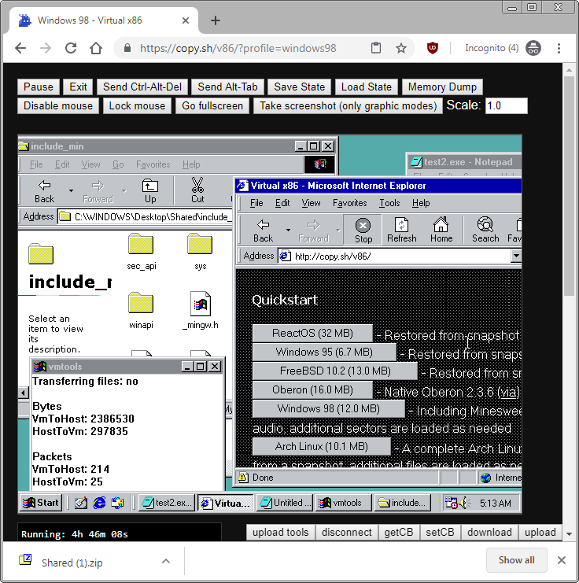

# ww32vmt (web win32 virtual machine tools)

This is a utility program which provides partial internet access, file transfer capabilites and clipboard access on Windows virtual machines implemented within a web browser.

It has been tested on v86, JSLinux, and DOSBox.

It works on Windows 95, Windows 98, and Windows 2000 guest operating systems.

The above image shows copy.sh/v86/ loaded without any external proxy server. In the background are some header files from TCC which were transerred into the VM, those files were then copied back out of the VM as "Shared (1).zip".

## How it works

It works by searching for specific blocks in the memory of the guest OS, then using those blocks of memory as a way of communicating between JavaScript in the win32 tool coded in C. This method of communication means that very little needs to be known about the internals of the emulator, and no direct modifications of the emulator are required (other than getting access to the OS memory in the global scope of JavaScript).

One drawback of this approach is that as the OS memory gets more fragmented it becomes less likely that it will be able to find the desired blocks of memory. With some additional knowledge of the internal layout of memory it might be possible to ensure a 100% success rate of finding the blocks.

## Usage

If you're using v86 see the notes [here](https://github.com/pixeltris/ww32vmt/blob/2ef570fd1391d7f0925f25d5fa9c59ffd69c1ce2/vmtools.js#L12).

- Compile vmtools.c / vmtools_stub.c with TCC (see the first lines of those c files for compilation args). Using TCC is important on vmtools_stub.c in order to keep it at or under 4096 bytes long. _[Feel free to use the prebuilt binaries](https://github.com/pixeltris/ww32vmt/tree/master/build)_
- Load the desired x86 web VM which runs Windows.
- Copy / paste vmtools.js into the developer tools console (`F12` / `Ctrl+Shift+J`).
- Create a text file in the VM with text `!hello-x86!fffffffffffffff` (f repeated 4k+ times) using notepad, and save it as an executable (.exe).
- Click `upload tools` and select both files `vmtools.exe` / `vmtools_stub.exe`.
- Copy/paste the text file executable. Run the copied version (creating a copy is only really required on Windows 2000, as it fails to run the original).
- Click the `connect` button. It should now be connected to the VM.

## Internet

As vmtools.exe is a simple usermode win32 program it can't provide full internet access. Instead it provides simple proxy servers (SOCKS / HTTP / DNS) which can be used in combination with Internet Explorer config and tools suchs as SocksCap. `WvSocksServer` implements the proxy servers which JavaScript connects to via the WebSocket API.

There is an additional HTTP proxy server implementation which supports direct HTTP requests in JavaScript via XMLHttpRequest. This avoids having to run a proxy server to forward requests. One drawback of this type of proxy is that it's subject to the limitations of [CORS](https://en.wikipedia.org/wiki/Cross-origin_resource_sharing), therefore you can pretty much limited to accessing sites explicitly flagged as `Access-Control-Allow-Origin: *`.

NOTE: Internet access depends on TCP/IP being installed (and maybe Winsock 2+)

#### IP/ports used in the VM

- HTTP - localhost:80
- HTTPS - localhost:443 (doesn't work on Internet Explorer?)
- DNS - localhost:53
- HTTP (XMLHttpRequest) - localhost:980
- HTTPS (XMLHttpRequest) - localhost:9443 (this currently isn't implemented as it requires manually handling TLS/SSL)

#### Ports used by proxy servers (WebSocket - currently set up to be ws:// rather than wss://)

- SOCKS 861
- DNS 862
- HTTP 863
- HTTPS 864

#### Ports used by the WvSocksServer implementation of the proxy servers

When a connection is made to a WebSocket server, it then creates a client to connect to one of the following locally hosted proxy servers (which handles the actual proxy connection). DNS is simple enough to just forward the requests directly.

- SOCKS 961
- HTTP 962
- HTTPS 963

## Clipboard

`getCB` can be used to get the current clipboard text from the VM. When `getCB` is a button, you can press it to fetch the VM clipboard contents. When it's a text box you need to use the 'copy' keyboard shortcut which will request the text from the VM (a further shortcut may need to be pressed if the textbox says "OK").

`setCB` can be used to set the VM clipboard text. When `setCB` is a button, you can press it to set the VM clipboard contents. When it's a text box you need to use the 'paste' keyboard shortcut to set the VM clipboard contents. NOTE: This doesn't automatically invoke a 'paste' inside the VM, you will still need to do that manually.

## File transfer

The `download` button can be used to fetch the contents of a folder named `Shared` next to vmtools.exe, and download it as a zip/tar.

The `upload` button can be used to transfer one or more files to VM. If you chose exactly one `.zip` or `.tar` file then it will automatically extract the archive when sending it to the VM.

- NOTE: vmtools may freeze while files are being transferred. You can view the developer tools console (`F12` / `Ctrl+Shift+J`) which will write a log each time a file is being transferred.
- NOTE: This all happens locally. None of this requires communication with a server.
